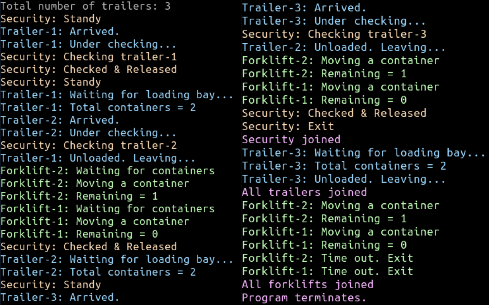

# Warehouse Simulation (C, POSIX Threads)

A small, single-file concurrency simulation that models a warehouse receiving trailers, performing security checks, unloading containers into loading bays, and moving those containers into storage with forklifts. It uses POSIX threads, semaphores, and mutexes, and prints color-coded logs to visualize the workflow.

## Overview
- Simulates trailers arriving at random intervals and requesting security checks.
- Controls loading bays and container availability with semaphores.
- Uses forklifts to move containers from the bay into the warehouse until idle timeout.
- Synchronizes shared state (remaining containers, printing, current trailer ID) with mutexes.
- Prints color-coded messages for roles and lifecycle events.

## Build

```bash
# install gcc
sudo apt install gcc

# move to the project directory
# example:
cd Warehouse_Simulation

# compile the program
gcc warehouse_solution.c -o count -lpthread
```

## Run
- Usage expects a single argument: number of trailers between 3 and 10.
- Example:

```bash
./count 3
```

You will see colored logs showing trailer arrivals, security checks, unloading progress, forklifts moving containers, and orderly shutdown when all work completes or forklifts hit their idle timeout.



## Roles & Flow
- Security Officer:
  - Waits for security requests from arriving trailers.
  - Checks and releases trailers, then signals completion.
  - Shuts down after all trailers are processed.
- Trailers:
  - Arrive at randomized intervals and request security checks.
  - Wait for an available loading bay, unload containers, and leave.
  - Make containers available to forklifts via a semaphore.
- Forklifts:
  - Wait for container availability and move containers into storage.
  - Keep track of remaining containers and exit on idle timeout.

## Output Colors
Defined at the top of the file:

- Trailer: Light blue
- Security: Light peach
- Forklift: Light green
- Join/Status: Light pink

Each log line resets color automatically.
